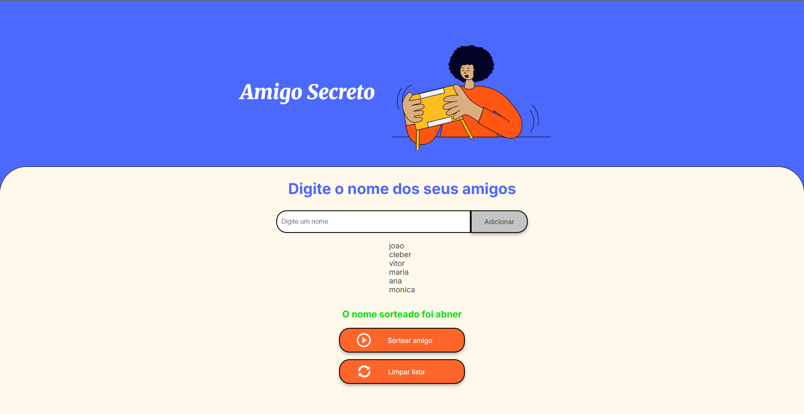

##Sorteador de Amigo Secreto
Este é um projeto simples e interativo para sortear o amigo secreto de forma digital. A aplicação permite que os usuários
insiram nomes em uma lista, sorteiem um dos participantes aleatoriamente e reiniciem o jogo a qualquer momento.

##Funcionalidades
O projeto foi desenvolvido com as seguintes funcionalidades principais:

Adicionar e Validar Nomes: Os usuários podem adicionar nomes a uma lista. A aplicação valida se o nome não está vazio, evita nomes 
duplicados e só aceita nomes compostos por letras.
Exibir a Lista: Os nomes adicionados são exibidos dinamicamente na tela em uma lista.
Sortear Amigo Secreto: Um botão realiza o sorteio aleatório, selecionando um dos nomes da lista e exibindo o resultado na tela.
Reiniciar o Jogo: Um botão de reset limpa a lista de amigos, o resultado do sorteio e prepara a aplicação para um novo jogo.
Evitar Repetições: Após o sorteio, o nome do amigo é removido da lista para que o mesmo nome não seja sorteado novamente.

##Tecnologias Utilizadas

As seguintes tecnologias foram usadas na construção deste projeto:

HTML5: Para a estrutura e marcação da página.
CSS3: Para a estilização e o design responsivo da interface.
JavaScript: Para toda a lógica da aplicação, incluindo a manipulação do DOM, validações e o algoritmo de sorteio.

##Como Usar

Clone este repositório para a sua máquina local.
Abra o arquivo index.html no seu navegador de preferência.

